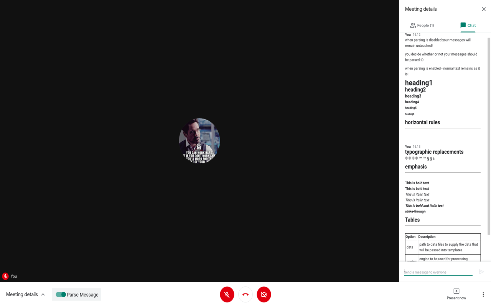

# google-meet-tex-support
This is a Greasemonkey/Tampermonkey user script which can be used to parse tex-equations in chat-window!

# How to use  
1. Install [Greasemonkey](https://addons.mozilla.org/en-US/firefox/addon/greasemonkey/) (if you are using Firefox) or [Tampermonkey](https://chrome.google.com/webstore/detail/tampermonkey/dhdgffkkebhmkfjojejmpbldmpobfkfo?hl=en) (if you are using Chrome).
2. Add `script.js` as a new script to Greasemonkey/Tampermonkey.
3. Browse https://meet.google.com and start writing an equation within $...$.

# Previews
  

# Suggestions?
Please open an issue or code it up and send a pull request.  
For any query please contact `shubhampanchal9773@gmail.com`  

