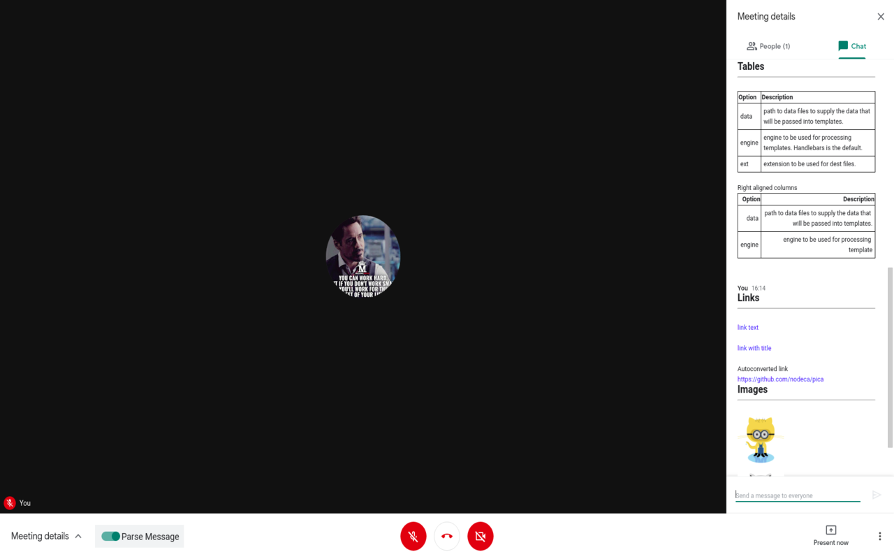
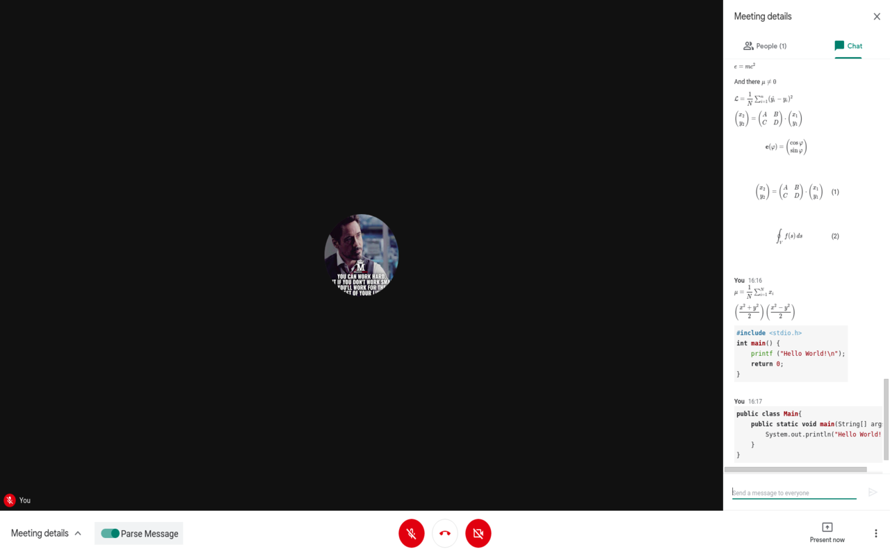
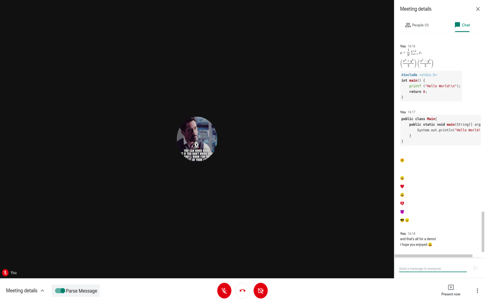

# google-meet-math-support
This is a chrome extenstion to parse markdown and tex-equations in Google Meet Chat Window!  
- Click [here](https://panchalshubham.github.io/google-meet-tex-support#references) to browse the docs  
- Click [here](https://panchalshubham.github.io/google-meet-tex-support#playground) to browse the playground  

# Previews
  
  
  
  
  
  

# Suggestions?
Please open an issue or code it up and send a pull request.  
For any query please contact `shubhampanchal9773@gmail.com`  

